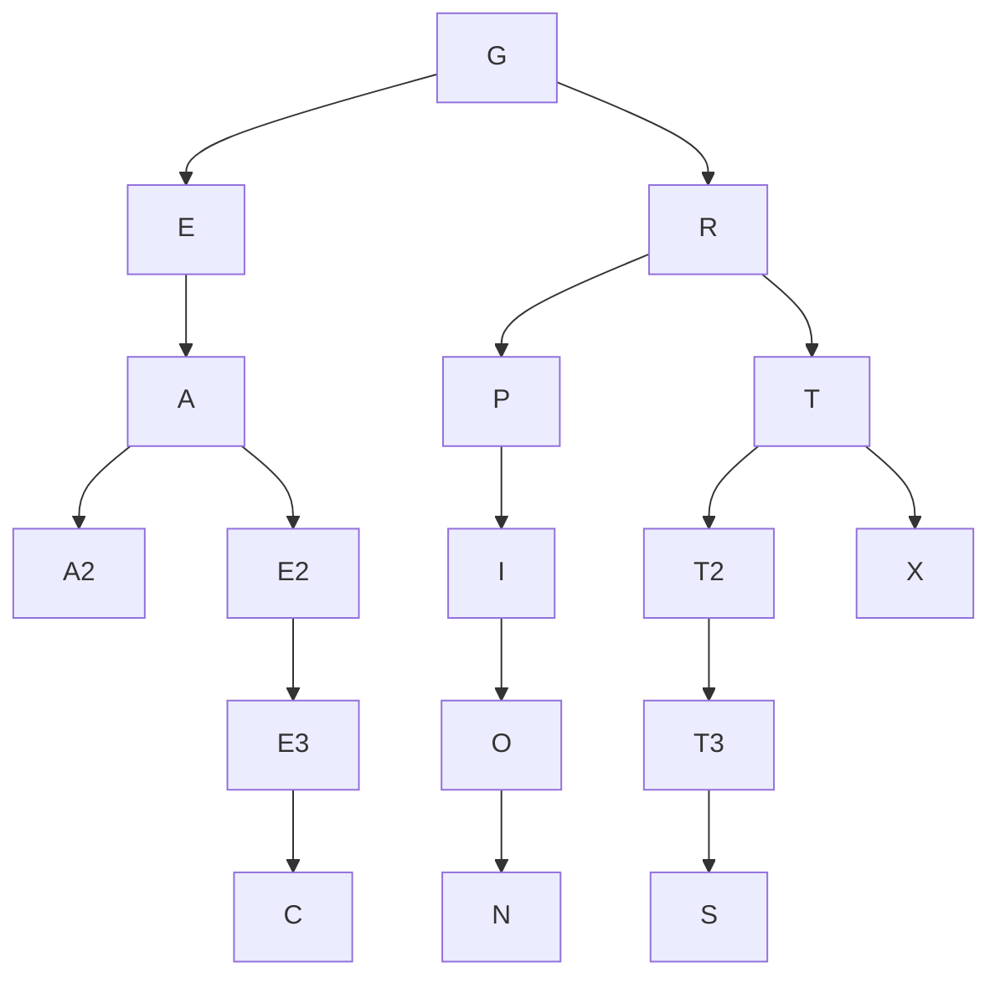

# 2016-17 Contest Short answers
1. Boolean Algebra
Simplify the following Boolean expression:
$\bar{A}(B+ \bar{A}) + A\bar{B}+ B(A+ \bar{A}B)$

Solution
$$
\bar{A}(B+ \bar{A}) + A\bar{B}+ B(A+ \bar{A}B)  \\
= \bar{A}B + \bar{A} \bar{A} +  A\bar{B} + AB + \bar{A}BB \\
= \bar{A}B + \bar{A}  +  A\bar{B} + AB + \bar{A}B \\
= \bar{A}B + \bar{A}  +  A\bar{B} + AB \\
= \bar{A} (B+1) + A (\bar{B} + B) \\
= \bar{A} + A \\
= 1 
$$

2. How many ordered triples make the following Boolean expression TRUE?

$\overline{ A \overline{(B + \overline{C})} }$

Solution
$$
\overline{ A \overline{(B + \overline{C})} } \\
= \bar{A} +  \overline{ \overline{(B + \overline{C})} } \\
= \bar{A} + (B + \overline{C}) \\
= \bar{A} + B + \overline{C}
$$

$$
\begin{bmatrix}
A & B  & C & Results  \\
0 & 0 & 0 & T\\
0 & 0 & 1 & T\\
0 & 1 & 0 & T\\
0 & 1 & 1 & T\\
1 & 0 & 0 &  T\\
1 & 0 & 1 & F\\
1 & 1 & 0 & T\\
1 & 1 & 1 & T
\end{bmatrix}
$$

3. Data Structures
 List all nodes that have two children in the binary search tree for:
GREATEXPECTATIONS

Solution
G R E A T E X P E C T A T I O N S
G R E A T E2 X P E3 C T2 A T3 I O N S

So the nodes that have two children in the binary search tree:
G A R T

4. Data Structures
The operation SW switches a queue to a stack and a stack to a queue.
Given an initially empty queue and the following sequence of
operations, what would be the next POPPED element?
PUSH(M), PUSH(I), PUSH(S), POP(X), PUSH(S), PUSH(H),
POP(X), POP(X), PUSH(A), POP(X), SW, PUSH(V), PUSH(I),
POP(X), PUSH(S), PUSH(H), PUSH(A), POP(X), PUSH(M),
POP(X), POP(X)

Solution:
empty queue
PUSH(M)   queue(M)
PUSH(I)   queue(M, I)
PUSH(S)   queue(M, I, S) 
POP(X)    queue(I,S) 
PUSH(S)   queue(I,S,S)
PUSH(H)   queue(I,S,S,H)
POP(X)    queue(S,S,H)
POP(X)    queue(S,H) 
PUSH(A)   queue(S,H,A) 
POP(X)    queue(H,A)
SW        Switch to a stack
PUSH(V)   stack(H,A,V) 
PUSH(I)   stack(H,A,V,I)
POP(X)    stack(H,A,V)
PUSH(S)   stack(H,A,V,S) 
PUSH(H)   stack(H,A,V,S,H)
PUSH(A)   stack(H,A,V,S,H,A) 
POP(X)    stack(H,A,V,S,H)
PUSH(M)   stack(H,A,V,S,H,M)
POP(X)    stack(H,A,V,S,H)
POP(X)    stack(H,A,V,S)
the next POPPED element will be S
